# Phase 1.1: Database Schema Documentation - MagalGenis EHR

## Complete Entity Relationship Diagram

```mermaid
erDiagram
    %% Core User Management
    users ||--o{ user_roles : "has"
    users ||--o{ staff_profiles : "has"
    users ||--o{ certifications : "owns"
    users ||--o{ supervision_relationships : "supervises/supervised_by"
    
    %% Client/Patient Management
    users ||--o{ clients : "assigned_clinician"
    clients ||--o{ client_phone_numbers : "has"
    clients ||--o{ client_emergency_contacts : "has"
    clients ||--o{ client_insurance : "has"
    clients ||--o{ client_diagnoses : "has"
    clients ||--o{ client_medications : "has"
    clients ||--o{ client_substance_history : "has"
    clients ||--o{ client_treatment_history : "has"
    clients ||--o{ client_primary_care_providers : "has"
    
    %% Clinical Documentation
    users ||--o{ clinical_notes : "provider"
    clients ||--o{ clinical_notes : "patient"
    clinical_notes ||--o{ note_versions : "versioned"
    clinical_notes ||--o{ note_reminders : "has"
    clinical_notes ||--o{ note_completion_tracking : "tracked"
    
    %% Scheduling
    users ||--o{ appointments : "provider"
    clients ||--o{ appointments : "patient"
    appointments ||--o{ appointment_conflicts : "has"
    appointments ||--o{ appointment_reminders : "has"
    clients ||--o{ appointment_waitlist : "waitlisted"
    
    %% Messaging
    users ||--o{ conversations : "therapist"
    clients ||--o{ conversations : "client"
    conversations ||--o{ messages : "contains"
    users ||--o{ messages : "sender"
    messages ||--o{ message_recipients : "sent_to"
    
    %% Billing & Claims
    users ||--o{ claims : "provider"
    clients ||--o{ claims : "patient"
    claims ||--o{ claim_line_items : "contains"
    clients ||--o{ insurance_verifications : "verified"
    clients ||--o{ patient_statements : "billed"
    
    %% Compliance & Audit
    users ||--o{ audit_logs : "performed_action"
    users ||--o{ hipaa_access_logs : "accessed"
    users ||--o{ compliance_deadlines : "has"
    users ||--o{ deadline_exception_requests : "requested"
    
    %% Practice Management
    users ||--o{ patient_access_permissions : "granted_to"
    clients ||--o{ patient_access_permissions : "access_to"
    
    %% Performance & Analytics
    users ||--o{ performance_metrics : "generated_by"
    users ||--o{ aggregated_metrics : "provider"
    clients ||--o{ aggregated_metrics : "client"
    
    %% System Tables
    query_cache {
        uuid id PK
        text cache_key UK
        jsonb cache_data
        timestamp expires_at
        timestamp created_at
    }
    
    rate_limits {
        uuid id PK
        text identifier UK
        integer request_count
        timestamp created_at
        timestamp updated_at
    }
    
    api_logs {
        uuid id PK
        text method
        text url
        integer status_code
        integer response_time_ms
        uuid user_id FK
        inet ip_address
        text user_agent
        jsonb request_body
        jsonb response_body
        text error_message
        timestamp created_at
    }
```



## Complete Table Documentation

### 🔐 Core User & Authentication Tables

#### `users` (Core Identity Table)
| Column | Type | Constraints | PHI | Description |
|--------|------|-------------|-----|-------------|
| id | uuid | PK, default gen_random_uuid() | ❌ | Internal user ID |
| auth_user_id | uuid | FK to auth.users | ❌ | Supabase auth reference |
| first_name | text | NOT NULL | ✅ | User's first name |
| last_name | text | NOT NULL | ✅ | User's last name |
| email | text | UNIQUE, NOT NULL | ✅ | User's email address |
| is_active | boolean | default true | ❌ | Account status |
| created_at | timestamp | default now() | ❌ | Account creation time |
| updated_at | timestamp | default now() | ❌ | Last update time |

**RLS Status:** ✅ Fully Protected  
**Relationships:** Core table - related to all user-specific data

#### `user_roles` (RBAC Implementation)
| Column | Type | Constraints | PHI | Description |
|--------|------|-------------|-----|-------------|
| id | uuid | PK, default gen_random_uuid() | ❌ | Role assignment ID |
| user_id | uuid | FK to users, NOT NULL | ❌ | User reference |
| role | user_role | ENUM, NOT NULL | ❌ | Role type |
| is_active | boolean | default true | ❌ | Role status |
| created_at | timestamp | default now() | ❌ | Assignment date |

**Available Roles:**
- Practice Administrator
- Clinical Administrator  
- Clinician
- Support Staff
- Billing Staff
- Compliance Officer

**RLS Status:** ✅ Protected - Users can view own roles, admins can manage all

### 👥 Client/Patient Management Tables

#### `clients` (Patient Master Record)
| Column | Type | Constraints | PHI | Description |
|--------|------|-------------|-----|-------------|
| id | uuid | PK, default gen_random_uuid() | ❌ | Patient ID |
| first_name | text | NOT NULL | ✅ | Patient first name |
| last_name | text | NOT NULL | ✅ | Patient last name |
| date_of_birth | date | | ✅ | Patient DOB |
| email | text | | ✅ | Patient email |
| assigned_clinician_id | uuid | FK to users | ❌ | Primary clinician |
| is_active | boolean | default true | ❌ | Patient status |
| hipaa_signed | boolean | default false | ❌ | HIPAA authorization |
| created_at | timestamp | default now() | ❌ | Registration date |

**RLS Status:** ✅ Protected - Role-based access with clinician assignments

#### `client_insurance` (Insurance Information)
| Column | Type | Constraints | PHI | Description |
|--------|------|-------------|-----|-------------|
| id | uuid | PK, default gen_random_uuid() | ❌ | Insurance record ID |
| client_id | uuid | FK to clients | ❌ | Patient reference |
| insurance_company | text | | ✅ | Insurance provider |
| policy_number | text | | ✅ | Policy number |
| group_number | text | | ✅ | Group number |
| is_active | boolean | default true | ❌ | Coverage status |

**RLS Status:** ✅ Protected - Linked to client access permissions

### 📋 Clinical Documentation Tables

#### `clinical_notes` (Clinical Documentation)
| Column | Type | Constraints | PHI | Description |
|--------|------|-------------|-----|-------------|
| id | uuid | PK, default gen_random_uuid() | ❌ | Note ID |
| provider_id | uuid | FK to users | ❌ | Authoring provider |
| client_id | uuid | FK to clients | ❌ | Patient reference |
| title | text | NOT NULL | ✅ | Note title |
| content | jsonb | NOT NULL | ✅ | Note content |
| note_type | note_type | ENUM | ❌ | Type of note |
| status | note_status | ENUM, default 'draft' | ❌ | Note status |
| signed_at | timestamp | | ❌ | Signature timestamp |
| signed_by | uuid | FK to users | ❌ | Signing provider |

**Note Types:** therapy_session, intake_assessment, treatment_plan, progress_note, discharge_summary  
**RLS Status:** ✅ Protected - Provider and assigned clinician access

### 📅 Scheduling Tables

#### `appointments` (Appointment Management)
| Column | Type | Constraints | PHI | Description |
|--------|------|-------------|-----|-------------|
| id | uuid | PK, default gen_random_uuid() | ❌ | Appointment ID |
| provider_id | uuid | FK to users | ❌ | Provider reference |
| client_id | uuid | FK to clients | ❌ | Patient reference |
| start_time | timestamp | NOT NULL | ✅ | Appointment start |
| end_time | timestamp | NOT NULL | ✅ | Appointment end |
| appointment_type | appointment_type | ENUM | ❌ | Type of appointment |
| status | appointment_status | ENUM, default 'scheduled' | ❌ | Appointment status |

**⚠️ RLS Status:** ❌ **CRITICAL - NO RLS POLICIES FOUND**

#### `appointment_reminders` (Reminder System)
| Column | Type | Constraints | PHI | Description |
|--------|------|-------------|-----|-------------|
| id | uuid | PK, default gen_random_uuid() | ❌ | Reminder ID |
| appointment_id | uuid | FK to appointments, NOT NULL | ❌ | Appointment reference |
| reminder_type | text | NOT NULL | ❌ | Type of reminder |
| send_before_minutes | integer | NOT NULL | ❌ | Lead time in minutes |
| is_sent | boolean | default false | ❌ | Delivery status |

**⚠️ RLS Status:** ❌ **CRITICAL - NO RLS POLICIES FOUND**

### 💬 Messaging Tables

#### `conversations` (Message Threads)
| Column | Type | Constraints | PHI | Description |
|--------|------|-------------|-----|-------------|
| id | uuid | PK, default gen_random_uuid() | ❌ | Conversation ID |
| therapist_id | uuid | FK to users, NOT NULL | ❌ | Therapist reference |
| client_id | uuid | FK to clients, NOT NULL | ❌ | Client reference |
| title | text | | ✅ | Conversation subject |
| status | text | default 'active' | ❌ | Conversation status |

**RLS Status:** ✅ Protected - Therapist and assigned clinician access

#### `messages` (Individual Messages)
| Column | Type | Constraints | PHI | Description |
|--------|------|-------------|-----|-------------|
| id | uuid | PK, default gen_random_uuid() | ❌ | Message ID |
| conversation_id | uuid | FK to conversations, NOT NULL | ❌ | Thread reference |
| sender_id | uuid | FK to users, NOT NULL | ❌ | Message sender |
| content | text | NOT NULL | ✅ | Message content |
| is_read | boolean | default false | ❌ | Read status |

**RLS Status:** ✅ Protected - Conversation participants only

### 💰 Billing & Claims Tables

#### `claims` (Insurance Claims)
| Column | Type | Constraints | PHI | Description |
|--------|------|-------------|-----|-------------|
| id | uuid | PK, default gen_random_uuid() | ❌ | Claim ID |
| provider_id | uuid | FK to users | ❌ | Billing provider |
| client_id | uuid | FK to clients | ❌ | Patient reference |
| claim_number | text | NOT NULL | ✅ | Claim identifier |
| service_date | date | NOT NULL | ✅ | Date of service |
| total_amount | numeric | NOT NULL | ✅ | Claim amount |
| status | claim_status | ENUM, default 'draft' | ❌ | Claim status |

**RLS Status:** ✅ Protected - Basic access controls in place

### 🔍 Compliance & Audit Tables

#### `hipaa_access_logs` (PHI Access Tracking)
| Column | Type | Constraints | PHI | Description |
|--------|------|-------------|-----|-------------|
| id | uuid | PK, default gen_random_uuid() | ❌ | Log entry ID |
| user_id | uuid | FK to users, NOT NULL | ❌ | Accessing user |
| patient_id | uuid | NOT NULL | ❌ | Patient accessed |
| access_type | text | NOT NULL | ❌ | Type of access |
| data_accessed | text | | ❌ | Specific data viewed |
| authorized | boolean | default true | ❌ | Access authorization |

**RLS Status:** ✅ Protected - Admins and own access logs only

#### `audit_logs` (General System Audit)
| Column | Type | Constraints | PHI | Description |
|--------|------|-------------|-----|-------------|
| id | uuid | PK, default gen_random_uuid() | ❌ | Log entry ID |
| user_id | uuid | FK to users | ❌ | User performing action |
| action | text | NOT NULL | ❌ | Action performed |
| resource_type | text | NOT NULL | ❌ | Resource affected |
| resource_id | uuid | | ❌ | Specific resource |
| details | jsonb | | ❌ | Additional details |

**RLS Status:** ✅ Protected - Administrator access only

## Critical Security Findings

### 🚨 Immediate Action Required

1. **Missing RLS Policies:**
   - `appointments` table has NO RLS policies
   - `appointment_reminders` table has NO RLS policies
   - These tables contain PHI (appointment times, patient references)

2. **Recommended RLS Policies for Appointments:**
   ```sql
   -- Allow providers to manage their own appointments
   CREATE POLICY "Providers can manage own appointments"
   ON appointments FOR ALL
   USING (provider_id = get_current_user_internal_id());
   
   -- Allow assigned clinicians to view client appointments
   CREATE POLICY "Clinicians can view assigned client appointments"
   ON appointments FOR SELECT
   USING (client_id IN (
     SELECT id FROM clients 
     WHERE assigned_clinician_id = get_current_user_internal_id()
   ));
   ```

### ✅ Security Strengths

1. **Comprehensive User Management:** Proper RBAC implementation
2. **PHI Protection:** Most clinical tables have appropriate RLS
3. **Audit Trails:** HIPAA access logging implemented
4. **Data Isolation:** Client data properly scoped to assigned clinicians

## PHI Classification Summary

### High PHI Risk Tables:
- `clients` (demographics, contact info)
- `clinical_notes` (clinical content)
- `appointments` (scheduling data)
- `messages` (communication content)
- `claims` (billing information)

### Low PHI Risk Tables:
- `users` (staff information)
- `user_roles` (permissions)
- `audit_logs` (system events)
- `query_cache` (performance data)

## Database Functions & Triggers

### Security Functions:
- `get_current_user_internal_id()` - Get internal user ID from auth
- `has_role()` - Check user permissions
- `can_access_patient()` - Verify patient access rights
- `log_hipaa_access()` - Record PHI access

### Audit Functions:
- `update_updated_at_column()` - Automatic timestamp updates
- `detect_appointment_conflicts()` - Scheduling conflict detection

## Next Steps

1. **Immediate:** Implement RLS policies for scheduling tables
2. **Phase 1.2:** Complete security and HIPAA compliance mapping
3. **Phase 1.3:** Document complete RBAC matrix
4. **Phase 2:** Begin module-by-module functional documentation

---
**Last Updated:** January 16, 2025  
**Status:** Phase 1.1 Complete  
**Next Phase:** 1.2 Security & HIPAA Compliance Mapping