# Phase 2.2: Clients Module Documentation

## Mermaid Diagram - Client Module Architecture

```mermaid
graph TB
    subgraph "Client Module Architecture"
        A[ClientList.tsx] --> B[Client List Components]
        A --> C[AddClientModal.tsx]
        A --> D[ClientDetailView.tsx]
        
        B --> E[ClientSearch.tsx]
        B --> F[ClientGrid.tsx] 
        B --> G[ClientCard.tsx]
        B --> H[VirtualizedClientList.tsx]
        B --> I[ClientListHeader.tsx]
        B --> J[ClientEmptyState.tsx]
        B --> K[ClientLoadingState.tsx]
        B --> L[ClientErrorState.tsx]
        
        C --> M[Client Form Tabs]
        M --> N[BasicInfoTab.tsx]
        M --> O[ContactInfoTab.tsx]
        M --> P[DemographicsTab.tsx]
        M --> Q[BillingTab.tsx]
        M --> R[SettingsTab.tsx]
        
        D --> S[Client Detail Components]
        S --> T[ClientDetailHeader.tsx]
        S --> U[ClientQuickInfo.tsx]
        S --> V[ClientDetailTabs.tsx]
        
        W[useClientForm.ts] --> C
        W --> D
        
        X[clientService.ts] --> Y[Client Service Layer]
        Y --> Z[clientCoreService.ts]
        Y --> AA[phoneNumbersService.ts]
        Y --> BB[emergencyContactsService.ts]
        Y --> CC[insuranceService.ts]
        Y --> DD[primaryCareProviderService.ts]
        Y --> EE[clientDataTransforms.ts]
        
        FF[types/client.ts] --> GG[Type Definitions]
        GG --> HH[ClientFormData]
        GG --> II[PhoneNumber]
        GG --> JJ[EmergencyContact]
        GG --> KK[InsuranceInfo]
        GG --> LL[PrimaryCareProvider]
        
        MM[Database Tables] --> NN[clients]
        MM --> OO[client_phone_numbers]
        MM --> PP[client_emergency_contacts]
        MM --> QQ[client_insurance]
        MM --> RR[client_primary_care_providers]
    end
    
    subgraph "Data Flow"
        SS[User Input] --> C
        C --> W
        W --> X
        X --> Y
        Y --> MM
        MM --> TT[Database Response]
        TT --> UU[UI Update]
    end
    
    subgraph "Search & Filter"
        VV[Search Input] --> E
        E --> A
        A --> WW[Filter Logic]
        WW --> XX[Filtered Results]
        XX --> F
    end
```

## Current Implementation Status

### ✅ Complete Components

#### 1. Client List Management
- **ClientList.tsx** - Main client listing component with pagination
- **ClientSearch.tsx** - Search functionality for name/email filtering
- **ClientGrid.tsx** - Grid layout for client cards
- **VirtualizedClientList.tsx** - Performance-optimized list for large datasets
- **ClientCard.tsx** - Individual client display card

#### 2. Client Form System
- **AddClientModal.tsx** - Comprehensive client creation/editing modal
- **5 Form Tabs** - Organized data entry across logical sections:
  - BasicInfoTab.tsx (Name, DOB, Clinician assignment)
  - ContactInfoTab.tsx (Address, phone, emergency contacts, PCP)
  - DemographicsTab.tsx (Demographics and personal info)
  - BillingTab.tsx (Insurance information)
  - SettingsTab.tsx (Preferences and HIPAA)

#### 3. Client Detail Views
- **ClientDetailView.tsx** - Complete client profile display
- **ClientDetailHeader.tsx** - Client summary header
- **ClientQuickInfo.tsx** - Key information overview
- **ClientDetailTabs.tsx** - Organized detail sections

#### 4. Service Layer
- **clientService.ts** - Main orchestration service
- **Specialized Services**:
  - clientCoreService.ts (Core CRUD operations)
  - phoneNumbersService.ts (Phone number management)
  - emergencyContactsService.ts (Emergency contact handling)
  - insuranceService.ts (Insurance information)
  - primaryCareProviderService.ts (PCP management)
  - clientDataTransforms.ts (Data transformation utilities)

### 🔄 CRUD Operations Analysis

#### Create Operations ✅
- **Full Client Creation** with associated data
- **Transactional Support** - All related data saved together
- **Validation** - Form-level validation before submission
- **Error Handling** - Comprehensive error catching and user feedback

#### Read Operations ✅
- **Optimized Queries** - Selective field loading for performance
- **Pagination** - Built-in pagination for large datasets
- **Search & Filter** - Real-time search across name/email fields
- **Related Data Loading** - Automatic loading of phone numbers, contacts, insurance, PCP

#### Update Operations ✅
- **In-Place Editing** - Edit mode in same modal
- **Related Data Updates** - Updates all associated data tables
- **Optimistic Updates** - UI updates before confirmation

#### Delete Operations ⚠️
- **Soft Delete Support** - Uses `is_active` flag
- **No Hard Delete UI** - Missing delete functionality in UI components

### 🔍 Search and Filtering Capabilities

#### Current Search Features ✅
- **Real-time Search** - Instant filtering as user types
- **Multi-field Search** - Name, preferred name, email
- **Case-insensitive** - Flexible search matching
- **Performance Optimized** - Uses React Query caching

#### Advanced Filtering ⚠️
- **Missing Advanced Filters**:
  - Date of birth range
  - Assigned clinician filter
  - City/State filtering
  - Active/Inactive status toggle
  - Created date range

#### Virtualization ✅
- **VirtualizedClientList.tsx** - Handles large datasets efficiently
- **Performance Optimized** - Only renders visible items
- **Smooth Scrolling** - Maintains scroll performance

### 📋 Data Validation Rules

#### Form Validation ✅
- **Required Fields** - First name, last name validation
- **Email Validation** - Proper email format checking
- **Date Validation** - Date of birth format validation
- **Phone Validation** - Phone number format validation

#### Database Constraints ✅
- **NOT NULL Constraints** - First name, last name required
- **Foreign Key Constraints** - Proper relationships maintained
- **Enum Validation** - Timezone, gender, status enums

#### Missing Validation ⚠️
- **Age Validation** - No minimum/maximum age checks
- **Duplicate Prevention** - No duplicate client checking
- **Data Consistency** - No cross-field validation
- **Insurance Validation** - No policy number format validation

### 🔗 Associated Data Management

#### Phone Numbers ✅
- **Multiple Phone Types** - Mobile, Home, Work, Other
- **Message Preferences** - SMS/Voice preference settings
- **Dynamic Addition/Removal** - Add/remove phone numbers in form

#### Emergency Contacts ✅
- **Primary Contact Designation** - Mark primary emergency contact
- **Relationship Tracking** - Define relationship to patient
- **Contact Information** - Phone and email for each contact

#### Insurance Information ✅
- **Primary/Secondary Insurance** - Support for multiple policies
- **Comprehensive Details** - Policy numbers, group numbers, copays, deductibles
- **Date Tracking** - Effective and termination dates

#### Primary Care Provider ✅
- **Provider Information** - Name, practice, contact details
- **Address Storage** - Full address information

### 🔒 Security Analysis

#### Authentication & Authorization ✅
- **RLS Policies** - Row Level Security implemented on all client tables
- **User-based Access** - Users can only access their assigned clients
- **Role-based Permissions** - Different access levels per user role

#### HIPAA Compliance ✅
- **PHI Protection** - All client tables have proper RLS
- **Audit Logging** - HIPAA access logs implemented
- **Data Minimization** - Only necessary fields exposed in API

#### Critical Security Issues ❌
- **No Access Control UI** - No interface to manage client access permissions
- **Missing Audit Trail** - No UI for viewing access logs
- **No Data Encryption** - Client data not encrypted at rest

### 🚨 Error Handling Analysis

#### Component-Level Error Handling ✅
- **ClientErrorState.tsx** - Dedicated error display component
- **Toast Notifications** - User-friendly error messages
- **Retry Mechanisms** - Users can retry failed operations

#### Service-Level Error Handling ✅
- **Try/Catch Blocks** - Comprehensive error catching
- **Error Logging** - Console error logging for debugging
- **Graceful Degradation** - UI remains functional during errors

#### Missing Error Handling ⚠️
- **Network Error Recovery** - No offline support
- **Validation Error Details** - Generic error messages
- **Bulk Operation Errors** - No partial failure handling

### 📊 Logging and Auditing

#### Current Logging ✅
- **Console Logging** - Development debugging logs
- **Performance Monitoring** - React Query cache monitoring
- **Error Tracking** - Error logging in services

#### HIPAA Audit Logging ✅
- **Access Logs** - `hipaa_access_logs` table exists
- **Database Functions** - `log_hipaa_access()` function available

#### Missing Audit Features ❌
- **No Audit UI** - No interface to view audit logs
- **No User Activity Tracking** - Missing detailed user action logs
- **No Data Change Tracking** - No history of client data changes

### 📈 Key Metrics and Analytics

#### Performance Metrics ✅
- **Query Optimization** - Selective field loading
- **Caching Strategy** - React Query with 5-minute stale time
- **Pagination Performance** - Efficient large dataset handling

#### Business Metrics ⚠️
- **Missing Metrics Dashboard** for:
  - Total active clients
  - New client registration trends
  - Client demographics breakdown
  - Clinician client load distribution

### 🔧 Technical Debt and TODOs

#### High Priority Issues
1. **Delete Functionality** - Add client deactivation UI
2. **Advanced Filtering** - Implement comprehensive filter options
3. **Audit UI** - Create interface for viewing access logs
4. **Data Validation** - Add comprehensive validation rules

#### Medium Priority Issues
1. **Bulk Operations** - Add bulk client import/export
2. **Advanced Search** - Add full-text search capabilities
3. **Client Merging** - Handle duplicate client scenarios
4. **Data History** - Track client data change history

#### Low Priority Issues
1. **Offline Support** - Add offline client data access
2. **Advanced Analytics** - Client engagement metrics
3. **Custom Fields** - User-configurable client fields

### 🎯 Compliance Score: 78/100

#### Strengths
- Complete CRUD operations (20/20)
- Solid security foundation (15/20)
- Good component architecture (18/20)
- Effective form handling (15/20)

#### Areas for Improvement
- Missing delete functionality (-5)
- No audit UI (-7)
- Limited validation rules (-5)
- No advanced filtering (-5)

### 📋 Implementation Roadmap

#### Phase 1: Critical Security (1-2 weeks)
1. Implement audit log viewing UI
2. Add client access permission management
3. Enhance data validation rules

#### Phase 2: Enhanced Functionality (2-3 weeks)
1. Add client deactivation/deletion UI
2. Implement advanced filtering system
3. Create bulk operation capabilities

#### Phase 3: Analytics and Optimization (2-3 weeks)
1. Build client metrics dashboard
2. Add data change history tracking
3. Implement full-text search

#### Phase 4: Advanced Features (3-4 weeks)
1. Add offline support
2. Create client merging tools
3. Implement custom field system

### 🔍 Specific Findings

#### What Currently Exists
- **Comprehensive Client Management** - Full lifecycle management
- **Multi-tab Form System** - Organized data entry
- **Associated Data Handling** - Phone, emergency contacts, insurance, PCP
- **Search and Pagination** - Basic search with pagination
- **Performance Optimization** - Query optimization and virtualization

#### Incomplete/TODO Items
- **Client Deletion UI** - Only soft delete via database
- **Advanced Filtering** - Limited to basic name/email search
- **Audit Log Interface** - Logs exist but no UI
- **Data Validation** - Basic validation, missing business rules
- **Bulk Operations** - No import/export functionality

#### Security Considerations
- **Proper RLS Implementation** - All client tables protected
- **HIPAA Compliance Foundation** - Audit logging infrastructure exists
- **Authentication Required** - All operations require authentication

#### HIPAA Requirements Addressed
- **PHI Protection** - Client data properly secured
- **Access Logging** - Infrastructure for audit trails
- **Data Minimization** - Selective field exposure

#### Critical Gaps
- **No Audit UI** - Cannot view who accessed what data
- **No Access Control Management** - Cannot manage client permissions
- **Limited Validation** - Missing business rule validation