# Phase 2.3: Documentation Module

## Mermaid Diagram - Documentation Module Architecture

```mermaid
graph TB
    subgraph "Documentation Module Architecture"
        A[Documentation.tsx] --> B[DocumentationTabs.tsx]
        B --> C[Create New Notes]
        B --> D[Notes List]
        B --> E[Pending Approvals]
        B --> F[Compliance Tracker]
        
        C --> G[CreateNoteGrid.tsx]
        G --> H[Note Types]
        H --> I[Intake Assessment]
        H --> J[Progress Note]
        H --> K[Treatment Plan]
        H --> L[Cancellation Note]
        H --> M[Contact Note]
        H --> N[Consultation Note]
        H --> O[Miscellaneous Note]
        
        D --> P[NotesList.tsx]
        P --> Q[NotesFilters.tsx]
        P --> R[NoteCard.tsx]
        P --> S[VirtualizedList]
        
        I --> T[IntakeAssessmentForm.tsx]
        J --> U[ProgressNoteForm.tsx]
        K --> V[TreatmentPlanForm.tsx]
        L --> W[CancellationNoteForm.tsx]
        M --> X[ContactNoteForm.tsx]
        N --> Y[ConsultationNoteForm.tsx]
        O --> Z[MiscellaneousNoteForm.tsx]
        
        U --> AA[SmartTemplates.tsx]
        AA --> BB[Template Categories]
        BB --> CC[CBT Templates]
        BB --> DD[DBT Templates]
        BB --> EE[Mindfulness Templates]
        BB --> FF[SOAP/DAP Templates]
        
        T --> GG[Finalization Sections]
        U --> GG
        V --> GG
        W --> GG
        X --> GG
        Y --> GG
        Z --> GG
        
        GG --> HH[E-Signature Component]
        HH --> II[Electronic Signature Input]
        HH --> JJ[Timestamp Recording]
        HH --> KK[User Validation]
        
        LL[Database Layer] --> MM[clinical_notes Table]
        MM --> NN[Note Status Management]
        NN --> OO[draft]
        NN --> PP[signed] 
        NN --> QQ[submitted_for_review]
        NN --> RR[approved]
        NN --> SS[rejected]
        NN --> TT[locked]
        
        UU[Service Layer] --> VV[Clinical Note Services]
        VV --> WW[CRUD Operations]
        VV --> XX[Status Transitions]
        VV --> YY[Version Control]
        VV --> ZZ[Locking Logic]
        
        AAA[Types & Validation] --> BBB[documentation.ts]
        BBB --> CCC[ClinicalNote Interface]
        BBB --> DDD[Note Type Definitions]
        BBB --> EEE[Form Data Interfaces]
        
        FFF[Compliance Features] --> GGG[ComplianceTracker.tsx]
        GGG --> HHH[Overdue Notes Detection]
        GGG --> III[Completion Metrics]
        GGG --> JJJ[Deadline Tracking]
    end
    
    subgraph "Note Workflow"
        KKK[Create Note] --> LLL[Draft Status]
        LLL --> MMM[Edit & Save]
        MMM --> NNN[Add E-Signature]
        NNN --> OOO[Signed Status]
        OOO --> PPP[Submit for Review]
        PPP --> QQQ[Review Process]
        QQQ --> RRR[Approved/Rejected]
        RRR --> SSS[Lock Note]
    end
    
    subgraph "Missing Features"
        TTT[Voice-to-Text ❌]
        UUU[Amendment Procedures ❌]
        VVV[Advanced Templates ⚠️]
        WWW[Billing Code Integration ⚠️]
    end
```

## Current Implementation Status

### ✅ Complete Note Types Available

#### 1. Clinical Note Types (7 Types) ✅
- **Intake Assessment** - Comprehensive client intake forms
- **Progress Notes** - SOAP/DAP format session documentation
- **Treatment Plans** - Goal-setting and treatment planning
- **Cancellation Notes** - Session cancellation documentation
- **Contact Notes** - Non-session client contact documentation  
- **Consultation Notes** - Professional consultation documentation
- **Miscellaneous Notes** - General purpose documentation

#### 2. Note Status Management ✅
- **Draft** - Editable notes in progress
- **Signed** - Electronically signed and finalized
- **Submitted for Review** - Awaiting supervisor approval
- **Approved** - Supervisor-approved notes
- **Rejected** - Notes requiring revision
- **Locked** - Read-only archived notes

### 📋 Templates Structure Analysis

#### Current Template System ✅
- **SmartTemplates.tsx** - Comprehensive template system for progress notes
- **Category-Based Organization** - Templates organized by therapeutic approach
- **Field-Specific Templates** - Different templates for different note sections

#### Available Template Categories ✅
1. **CBT Templates** - Cognitive challenging, thought records
2. **DBT Templates** - Distress tolerance, emotion regulation
3. **Mindfulness Templates** - Meditation, present-moment techniques
4. **SOAP Components** - Subjective, Objective, Assessment, Plan templates
5. **Intervention Templates** - Specific therapeutic interventions

#### Template Features ✅
- **Smart Insertion** - Templates append to existing content
- **Tag-Based Search** - Templates tagged for easy discovery
- **Field-Type Specific** - Templates matched to form field types
- **Customizable Content** - Placeholders for personalization

#### Missing Template Features ⚠️
- **Custom Template Creation** - No user-defined templates
- **Template Sharing** - No system for sharing templates between users
- **Template Versioning** - No version control for templates
- **Global Templates** - Templates only available in Progress Notes

### 🎤 Voice-to-Text Integration Analysis

#### Current Status ❌
- **No Voice-to-Text Implementation** - Missing entirely
- **No Audio Input Components** - No voice recording capabilities
- **No Speech Recognition** - No integration with speech-to-text services
- **No Voice Commands** - No voice-controlled navigation

#### Infrastructure Available ✅
- **Edge Functions Support** - Supabase edge functions available
- **File Upload Configuration** - Max file size settings exist
- **API Middleware** - Request handling infrastructure present

#### Potential Implementation Path ⚠️
- **OpenAI Whisper Integration** - Available via edge functions
- **Browser Speech API** - Web Speech API could be leveraged
- **Audio File Processing** - File upload system could handle audio

### 📝 E-Signature Workflow Analysis

#### Current Implementation ✅
- **Electronic Signature Components** - Signature input fields in all note types
- **Signature Validation** - Required for note finalization
- **Timestamp Recording** - Automatic signature timestamp capture
- **User Attribution** - Signature linked to authenticated user

#### Signature Features ✅
- **Finalization Sections** - Dedicated signature areas in forms
- **Signature Requirements** - Notes cannot be finalized without signature
- **Status Integration** - Signature triggers status change to 'signed'
- **Audit Trail** - Signature details stored in database

#### E-Signature Components by Note Type ✅
- **IntakeAssessmentForm** - `signature` field with validation
- **ProgressNoteForm** - Signature required for finalization
- **TreatmentPlanForm** - Provider and optional client signatures
- **CancellationNoteForm** - Electronic signature for documentation
- **ContactNoteForm** - Signature for billable contacts
- **ConsultationNoteForm** - Professional signature requirement
- **MiscellaneousNoteForm** - Signature for administrative notes

#### Missing E-Signature Features ❌
- **Digital Signature Security** - No cryptographic signatures
- **Signature Image Capture** - No handwritten signature capability
- **Co-Signature Workflows** - Limited supervisor signature support
- **Signature History** - No tracking of signature modifications

### 🔄 Amendment Procedures Analysis

#### Current Status ❌
- **No Amendment System** - Missing entirely
- **No Version History** - No tracking of note changes
- **No Amendment Audit Trail** - No record of modifications
- **No Amendment Workflows** - No formal amendment process

#### Database Support ⚠️
- **Version Field** - `clinical_notes.version` exists but unused
- **Note Versions Table** - `note_versions` table exists in schema
- **Timestamp Tracking** - Created/updated timestamps available

#### Missing Amendment Features ❌
- **Amendment Creation UI** - No interface for creating amendments
- **Change Tracking** - No diff/comparison between versions
- **Amendment Approval** - No supervisor approval for amendments
- **Amendment Notifications** - No alerts for note modifications
- **Amendment Restrictions** - No rules for when amendments are allowed

### 🔒 Locking/Unlocking Rules Analysis

#### Current Locking Implementation ✅
- **Locked Status** - Notes can be marked as 'locked'
- **Lock Timestamp** - `locked_at` field captures lock time
- **Status-Based Locking** - Locked notes become read-only
- **UI Indicators** - Locked notes display appropriate badges

#### Locking Rules ⚠️
- **Manual Locking Only** - No automatic locking rules
- **No Time-Based Locking** - No automatic locking after time periods
- **No Role-Based Unlocking** - No supervisor unlock capabilities
- **Limited Lock Reasons** - No tracking of why notes were locked

#### Missing Locking Features ❌
- **Automatic Locking Rules** - No compliance-based auto-locking
- **Unlock Workflows** - No formal unlock request process  
- **Lock Permissions** - No role-based lock/unlock permissions
- **Lock Audit Trail** - No tracking of lock/unlock activities
- **Conditional Locking** - No business rule-based locking

### 💰 Integration with Billing Codes

#### Current Implementation ⚠️
- **Billing Code Fields** - Present in some note types
- **Progress Notes** - `billing_code` field available
- **Consultation Notes** - Billing code support included
- **Contact Notes** - Billable flag and duration tracking

#### Billing Integration Features ✅
- **CPT Code Support** - `cpt_codes` table exists in database
- **Billable Contact Flags** - Contact notes can be marked billable
- **Session Duration Tracking** - Time tracking for billing purposes
- **Billing Settings** - Configuration options for billing integration

#### Missing Billing Features ❌
- **Automatic Code Suggestion** - No AI-powered code recommendations
- **Billing Code Validation** - No validation against valid CPT codes
- **Claims Integration** - No direct integration with billing/claims system
- **Revenue Tracking** - No financial reporting from documentation
- **Insurance Authorization** - No connection to authorization tracking

### 🔒 Security Considerations Implemented

#### Authentication & Authorization ✅
- **RLS Policies** - Row Level Security on `clinical_notes` table
- **Provider-Based Access** - Users can only access their own notes
- **Client-Based Access** - Access restricted to assigned clients
- **Role-Based Permissions** - Different access levels per user role

#### Data Protection ✅
- **HIPAA Compliance Infrastructure** - Audit logging available
- **Encrypted Storage** - Database-level encryption
- **Access Logging** - `hipaa_access_logs` table for tracking
- **Secure Transmission** - HTTPS/TLS for all communications

#### Critical Security Gaps ❌
- **No Amendment Audit Trail** - No tracking of note modifications
- **Limited Access Controls** - No granular permission system
- **No Data Loss Prevention** - No protection against data export
- **No Session Security** - No automatic session timeout for notes

### 📋 HIPAA Requirements Addressed

#### Compliance Features ✅
- **Access Controls** - User-based access restrictions
- **Audit Logging Infrastructure** - Database tables for logging access
- **Data Minimization** - Only necessary fields exposed
- **Secure Storage** - Database encryption at rest

#### HIPAA Compliant Features ✅
- **Digital Signatures** - Electronic signature audit trail
- **Timestamp Accuracy** - Precise documentation timestamps
- **User Attribution** - All actions linked to authenticated users
- **Status Tracking** - Complete workflow audit trail

#### HIPAA Compliance Gaps ❌
- **No Access Log UI** - Cannot view who accessed what
- **No Data Retention Policies** - No automatic data purging
- **No Breach Detection** - No monitoring for unauthorized access
- **No Patient Access Rights** - No patient portal for record access

### 🚨 Error Handling Analysis

#### Component-Level Error Handling ✅
- **EnhancedErrorBoundary** - Comprehensive error boundary implementation
- **Form Validation** - Client-side validation with error messages
- **Toast Notifications** - User-friendly error notifications
- **Retry Mechanisms** - Built-in retry for failed operations

#### Service-Level Error Handling ✅
- **API Error Handling** - Structured error responses
- **Database Error Handling** - SQL error catching and logging
- **Validation Errors** - Comprehensive input validation
- **Network Error Recovery** - Graceful handling of connection issues

#### Missing Error Handling ⚠️
- **Concurrent Edit Detection** - No conflict resolution for simultaneous edits
- **Auto-Save Recovery** - No recovery from browser crashes
- **Offline Support** - No offline note creation capability
- **Partial Save Recovery** - No recovery from partial save failures

### 📊 Logging and Auditing

#### Current Logging ✅
- **Console Logging** - Comprehensive debug logging
- **Performance Monitoring** - Query performance tracking
- **Error Tracking** - Detailed error logging with stack traces
- **User Action Logging** - Save/edit action logging

#### HIPAA Audit Infrastructure ✅
- **Database Functions** - `log_hipaa_access()` function available
- **Audit Log Tables** - `hipaa_access_logs` table structure
- **Access Tracking** - Infrastructure for tracking data access

#### Missing Audit Features ❌
- **No Audit UI** - No interface to view audit logs
- **No Real-time Monitoring** - No active monitoring dashboards
- **No Compliance Reporting** - No automated compliance reports
- **No Change History** - No detailed change tracking

### 🎯 Implementation Priorities

#### High Priority (Critical Gaps) ❌
1. **Voice-to-Text Integration** - Major functionality gap
2. **Amendment Procedures** - Critical for compliance
3. **Audit Log Interface** - Required for HIPAA compliance
4. **Billing Code Integration** - Revenue impact

#### Medium Priority (Enhancement) ⚠️
1. **Advanced Locking Rules** - Improved compliance
2. **Template Management** - User experience improvement
3. **Concurrent Edit Protection** - Data integrity
4. **Enhanced E-Signatures** - Security improvement

#### Low Priority (Nice-to-Have) ✅
1. **Offline Support** - Convenience feature
2. **Advanced Templates** - Productivity enhancement
3. **Mobile Optimization** - Accessibility improvement

### 📈 Compliance Score: 72/100

#### Strengths
- Comprehensive note type coverage (20/20)
- Strong e-signature implementation (15/20)
- Good security foundation (12/20)
- Solid template system (10/15)

#### Critical Gaps
- No voice-to-text integration (-10)
- No amendment procedures (-8)
- Limited billing integration (-5)
- No audit UI (-5)

### 🔍 What Currently Exists in the Codebase

#### Complete Documentation System ✅
- **7 Note Types** - Full implementation of clinical note types
- **Template System** - Smart templates with categorization
- **E-Signature Workflow** - Electronic signature in all note types
- **Status Management** - Complete workflow from draft to locked
- **Compliance Tracking** - Basic compliance monitoring

#### Robust Infrastructure ✅
- **Database Schema** - Complete clinical notes table structure
- **Service Layer** - CRUD operations and business logic
- **Component Architecture** - Modular, reusable components
- **Type Definitions** - Comprehensive TypeScript interfaces

#### Security Foundation ✅
- **Row Level Security** - Database-level access controls
- **Audit Infrastructure** - Tables and functions for compliance
- **Data Validation** - Input sanitization and validation
- **Error Handling** - Comprehensive error management

### 🔧 What Appears to be Incomplete or TODO Items

#### Major Missing Features ❌
1. **Voice-to-Text** - No speech recognition capabilities
2. **Amendment System** - No version control or amendment workflow
3. **Advanced Billing Integration** - Limited CPT code integration
4. **Audit UI** - Cannot view access logs or compliance reports

#### Partial Implementations ⚠️
1. **Locking Rules** - Manual locking only, no business rules
2. **Template Management** - No custom template creation
3. **Co-Signature Workflow** - Limited supervisor signature support
4. **Billing Validation** - No CPT code validation

#### Enhancement Opportunities ✅
1. **Mobile Optimization** - Notes interface could be more mobile-friendly
2. **Offline Support** - No offline note creation capability
3. **Advanced Search** - Limited search and filtering options
4. **Batch Operations** - No bulk note operations

### 📋 Final Assessment

The Documentation Module represents one of the most mature and comprehensive systems in the application. With 7 fully implemented note types, robust e-signature workflows, intelligent templates, and solid security foundations, it provides a strong clinical documentation platform. However, critical gaps in voice-to-text integration, amendment procedures, and audit interfaces prevent it from being a complete enterprise-grade solution.

The system demonstrates excellent architectural patterns, comprehensive type safety, and thoughtful user experience design. The smart template system and status management workflows show particular sophistication. Priority should be given to implementing voice-to-text capabilities and amendment procedures to complete the core functionality set.